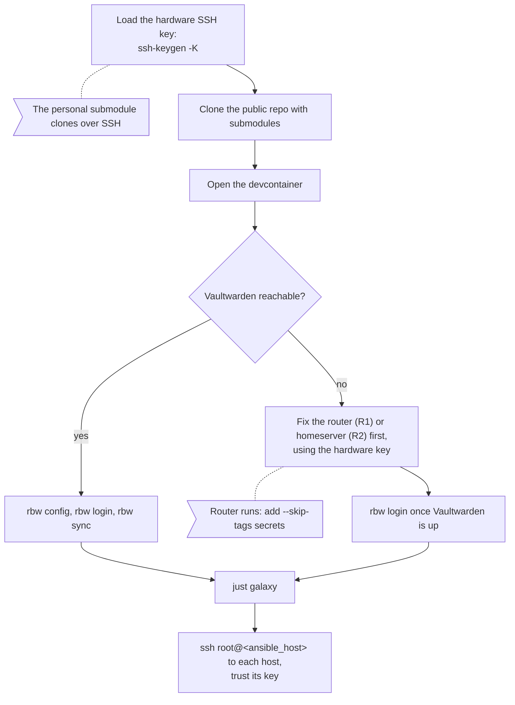

# R0 — Rebuild the laptop

```mermaid
flowchart TD
  A["Load the hardware SSH key:<br>ssh-keygen -K"]
  A -.- nA>"The personal submodule clones over SSH"]
  A --> B["Clone the public repo with submodules"]
  B --> C["Open the devcontainer"]
  C --> D{"Vaultwarden reachable?"}
  D -- yes --> E["rbw config, rbw login, rbw sync"]
  D -- no --> F["Fix the router (R1) or homeserver (R2) first,<br>using the hardware key"]
  F -.- nF>"Router runs: add --skip-tags secrets"]
  F --> G["rbw login once Vaultwarden is up"]
  E --> H["just galaxy"]
  G --> H
  H --> I["ssh root@#lt;ansible_host#gt; to each host,<br>trust its key"]
```

Vaultwarden down: [R1](r1-router.md), [R2](r2-homeserver.md).
