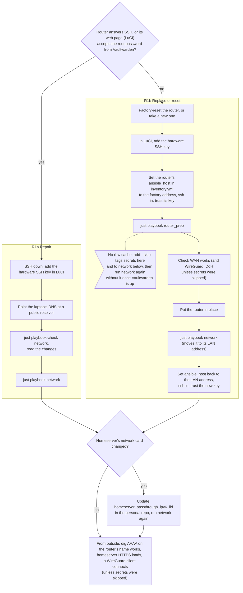

# R1 — Router

```mermaid
flowchart TD
  Q{"Router answers SSH, or its web page (LuCI)<br>accepts the root password from Vaultwarden?"}
  Q -- yes --> a1
  Q -- no --> b1
  subgraph R1a ["R1a Repair"]
    a1["SSH down: add the hardware SSH key in LuCI"]
    a1 --> a2["Point the laptop's DNS at a public resolver"]
    a2 --> a3["just playbook-check network,<br>read the changes"]
    a3 --> a4["just playbook network"]
  end
  subgraph R1b ["R1b Replace or reset"]
    b1["Factory-reset the router, or take a new one"]
    b1 --> b2["In LuCI, add the hardware SSH key"]
    b2 --> b3["Set the router's ansible_host in inventory.yml<br>to the factory address, ssh in, trust its key"]
    b3 --> b4["just playbook router_prep"]
    b4 -.- n4>"No rbw cache: add --skip-tags secrets here<br>and to network below, then run network again<br>without it once Vaultwarden is up"]
    b4 --> b5["Check WAN works (and WireGuard, DoH<br>unless secrets were skipped)"]
    b5 --> b6["Put the router in place"]
    b6 --> b7["just playbook network<br>(moves it to its LAN address)"]
    b7 --> b8["Set ansible_host back to the LAN address,<br>ssh in, trust the new key"]
  end
  a4 --> c1
  b8 --> c1
  c1{"Homeserver's network card changed?"}
  c1 -- yes --> c2["Update homeserver_passthrough_ipv6_iid<br>in the personal repo, run network again"]
  c1 -- no --> c3
  c2 --> c3["From outside: dig AAAA on the router's name works,<br>homeserver HTTPS loads, a WireGuard client connects<br>(unless secrets were skipped)"]
```
