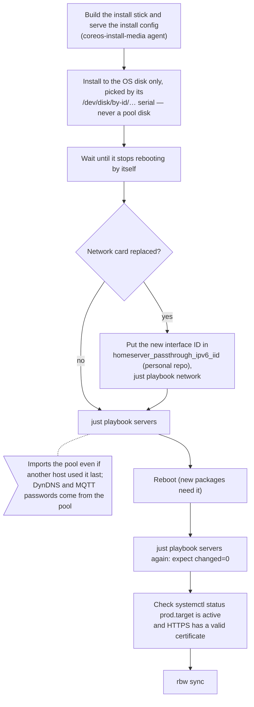

# R2 — Reinstall the homeserver (pool kept or restored)

```mermaid
flowchart TD
  A["Build the install stick and serve the install config<br>(coreos-install-media agent)"]
  A --> B["Install to the OS disk only, picked by its<br>/dev/disk/by-id/… serial — never a pool disk"]
  B --> C["Wait until it stops rebooting by itself"]
  C --> D{"Network card replaced?"}
  D -- yes --> E["Put the new interface ID in<br>homeserver_passthrough_ipv6_iid (personal repo),<br>just playbook network"]
  D -- no --> F
  E --> F["just playbook servers"]
  F -.- nF>"Imports the pool even if another host used it last;<br>DynDNS and MQTT passwords come from the pool"]
  F --> G["Reboot (new packages need it)"]
  G --> H["just playbook servers again: expect changed=0"]
  H --> I["Check systemctl status prod.target is active<br>and HTTPS has a valid certificate"]
  I --> J["rbw sync"]
```
