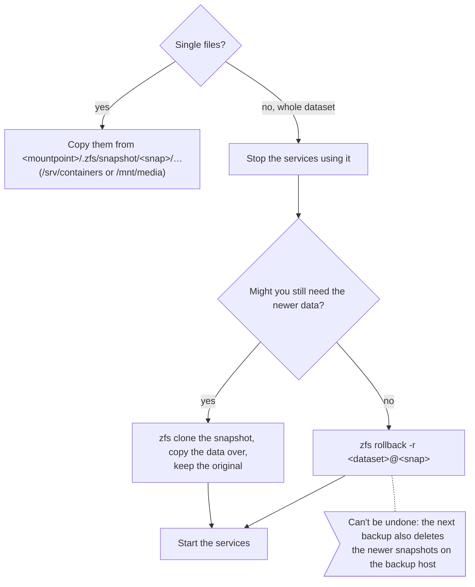

# R3 — Restore from snapshots on the homeserver

```mermaid
flowchart TD
  Q{"Single files?"}
  Q -- yes --> A["Copy them from #lt;mountpoint#gt;/.zfs/snapshot/#lt;snap#gt;/…<br>(/srv/containers or /mnt/media)"]
  Q -- "no, whole dataset" --> B["Stop the services using it"]
  B --> C{"Might you still need the newer data?"}
  C -- yes --> D["zfs clone the snapshot, copy the data over,<br>keep the original"]
  C -- no --> E["zfs rollback -r #lt;dataset#gt;@#lt;snap#gt;"]
  E -.- nE>"Can't be undone: the next backup also deletes<br>the newer snapshots on the backup host"]
  D --> F["Start the services"]
  E --> F
```
