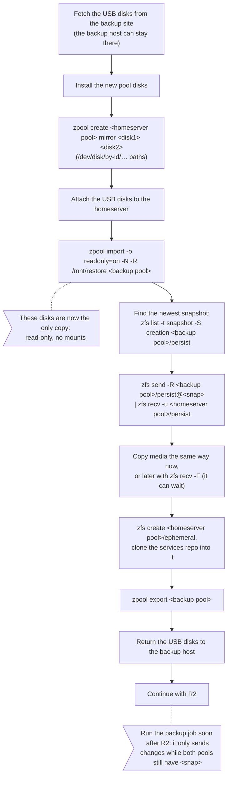

# R4 — Restore the homeserver pool from the USB disks

```mermaid
flowchart TD
  A["Fetch the USB disks from the backup site<br>(the backup host can stay there)"]
  A --> B["Install the new pool disks"]
  B --> C["zpool create #lt;homeserver pool#gt; mirror #lt;disk1#gt; #lt;disk2#gt;<br>(/dev/disk/by-id/… paths)"]
  C --> D["Attach the USB disks to the homeserver"]
  D --> E["zpool import -o readonly=on -N -R /mnt/restore #lt;backup pool#gt;"]
  E -.- nE>"These disks are now the only copy:<br>read-only, no mounts"]
  E --> F["Find the newest snapshot:<br>zfs list -t snapshot -S creation #lt;backup pool#gt;/persist"]
  F --> G["zfs send -R #lt;backup pool#gt;/persist@#lt;snap#gt;<br>#124; zfs recv -u #lt;homeserver pool#gt;/persist"]
  G --> H["Copy media the same way now,<br>or later with zfs recv -F (it can wait)"]
  H --> I["zfs create #lt;homeserver pool#gt;/ephemeral,<br>clone the services repo into it"]
  I --> J["zpool export #lt;backup pool#gt;"]
  J --> K["Return the USB disks to the backup host"]
  K --> L["Continue with R2"]
  L -.- nL>"Run the backup job soon after R2: it only sends<br>changes while both pools still have #lt;snap#gt;"]
```

Next: [R2](r2-homeserver.md).
