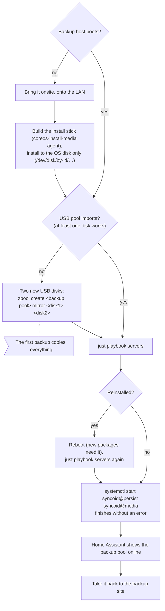

# R5 — Restore the backup

```mermaid
flowchart TD
  Q1{"Backup host boots?"}
  Q1 -- no --> A["Bring it onsite, onto the LAN"]
  A --> B["Build the install stick (coreos-install-media agent),<br>install to the OS disk only (/dev/disk/by-id/…)"]
  Q1 -- yes --> Q2
  B --> Q2{"USB pool imports?<br>(at least one disk works)"}
  Q2 -- no --> C["Two new USB disks:<br>zpool create #lt;backup pool#gt; mirror #lt;disk1#gt; #lt;disk2#gt;"]
  C -.- nC>"The first backup copies everything"]
  Q2 -- yes --> D
  C --> D["just playbook servers"]
  D --> Q3{"Reinstalled?"}
  Q3 -- yes --> E["Reboot (new packages need it),<br>just playbook servers again"]
  Q3 -- no --> F
  E --> F["systemctl start syncoid@persist syncoid@media<br>finishes without an error"]
  F --> G["Home Assistant shows the backup pool online"]
  G --> H["Take it back to the backup site"]
```
