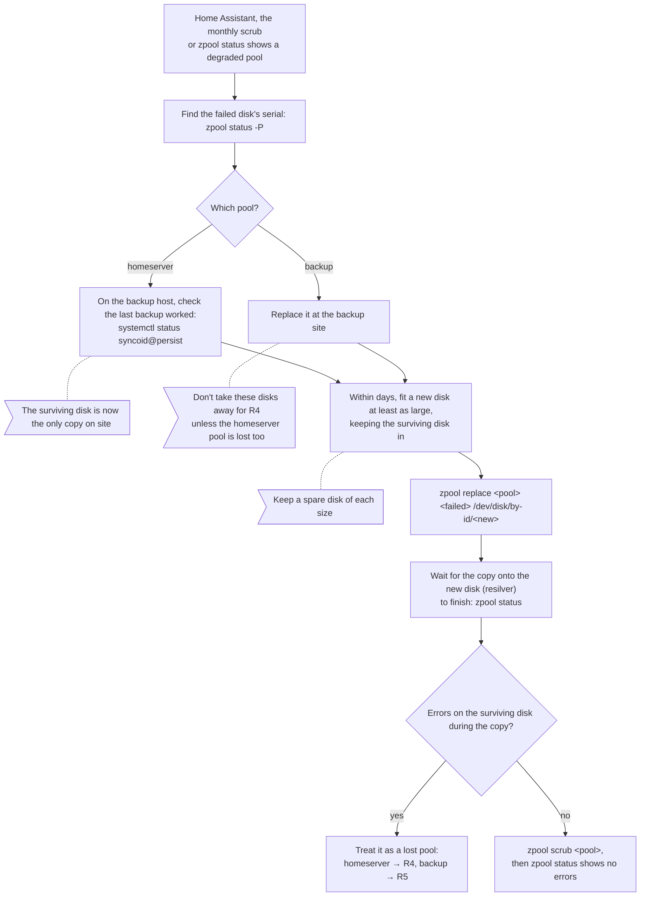

# R6 — Replace a failed mirror disk (homeserver or backup pool)

```mermaid
flowchart TD
  A["Home Assistant, the monthly scrub<br>or zpool status shows a degraded pool"]
  A --> B["Find the failed disk's serial: zpool status -P"]
  B --> Q1{"Which pool?"}
  Q1 -- homeserver --> C["On the backup host, check the last backup worked:<br>systemctl status syncoid@persist"]
  C -.- nC>"The surviving disk is now the only copy on site"]
  Q1 -- backup --> D["Replace it at the backup site"]
  D -.- nD>"Don't take these disks away for R4<br>unless the homeserver pool is lost too"]
  C --> E["Within days, fit a new disk at least as large,<br>keeping the surviving disk in"]
  D --> E
  E -.- nE>"Keep a spare disk of each size"]
  E --> F["zpool replace #lt;pool#gt; #lt;failed#gt; /dev/disk/by-id/#lt;new#gt;"]
  F --> G["Wait for the copy onto the new disk (resilver)<br>to finish: zpool status"]
  G --> Q2{"Errors on the surviving disk during the copy?"}
  Q2 -- yes --> H["Treat it as a lost pool:<br>homeserver → R4, backup → R5"]
  Q2 -- no --> I["zpool scrub #lt;pool#gt;,<br>then zpool status shows no errors"]
```

Lost pool: [R4](r4-pool.md) (homeserver), [R5](r5-backup.md) (backup).
